# ⚙️ Dynamics of a Material Point – Numerical Integration Methods  

---

## Project Overview

This project focuses on solving the equations of motion for a material point using numerical integration methods applied to a system of first-order differential equations. The goal is to compare the numerical properties and physical accuracy of several schemes under different simulation settings, such as:

- Constant vs. adaptive time step  
- Influence of damping (resistance)  
- Convergence and energy conservation properties

We model the motion of a material point with mass **m = 1 kg** in a double-well potential:

`phi(x) = -exp(-x² / l₁²) - 8 * exp(-(x - 2)² / l₂²)`  
where:  
**l₁ = 1 m**, **l₂ = 1 / sqrt(8) m**

Initial conditions:  
**x₀ = 2.8 m**, **v₀ = 0 m/s**

---

## Numerical Integration Methods

Four integration schemes were implemented, each differing in complexity, accuracy, and energy behavior:

### 1. Euler's Explicit Method

> 📌 First-order, explicit scheme.  
> ❗ Very simple but introduces large numerical errors and tends to artificially increase energy.

Update rule:

x[n+1] = x[n] + v[n] * dt

v[n+1] = v[n] + a(x[n]) * dt

---

### 2. Velocity Verlet Method

> 📌 Second-order, symplectic method.  
> ✅ Good energy conservation and physical accuracy over long times.

Update rule:

x[n+1] = x[n] + v[n] * dt + 0.5 * a[n] * dt²

v[n+1] = v[n] + 0.5 * (a[n] + a[n+1]) * dt

---

### 3. Runge-Kutta 4th Order (RK4)

> 📌 High-accuracy, 4th-order method.  
> ⚠️ Not symplectic – may slowly increase energy in long simulations.

RK4 uses 4 intermediate steps (k1 to k4) to compute:

y[n+1] = y[n] + (dt/6) * (k1 + 2k2 + 2k3 + k4)

Each `k` involves evaluating the derivative function at intermediate points.

---

### 4. Trapezoidal Method

> 📌 Second-order, implicit method.  
> ⚖️ Provides good stability but tends to dissipate energy (underestimates dynamics).

Update rule:
y[n+1] = y[n] + (dt / 2) * (f(y[n], t[n]) + f(y[n+1], t[n+1]))

Requires solving for `y[n+1]` iteratively (e.g., via fixed-point or Newton's method).

---

## Fixed Time Step Integration

> In this experiment, we integrated the equations of motion for t ∈ [0, 100 s] using each method with a **constant time step**.  
> Time steps were selected based on the method’s order of accuracy to ensure stable and representative results.

Chosen time steps:

- Euler: dt = 1e-6 s  
- Verlet: dt = 1e-4 s  
- RK4: dt = 1e-3 s  

A fixed spatial resolution of dx = 1e-3 m was used for force evaluation.

---

### 🔹 Position over Time – x(t)

  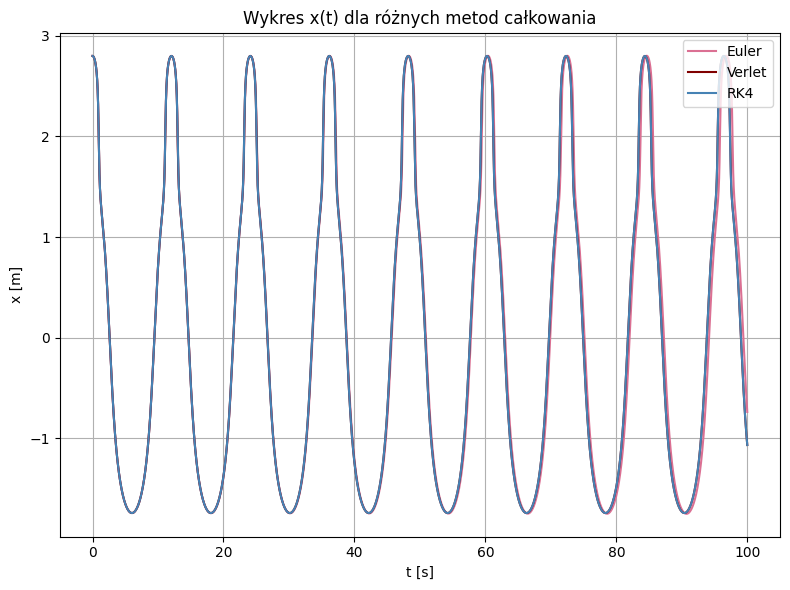

**Observation:**  
- Initially, all methods overlap closely.  
- Over time, the Euler method diverges due to cumulative local errors → visible phase shift.  
- RK4 and Verlet remain in agreement, showing superior long-term stability.

---

### 🔹 Velocity over Time – v(t)

  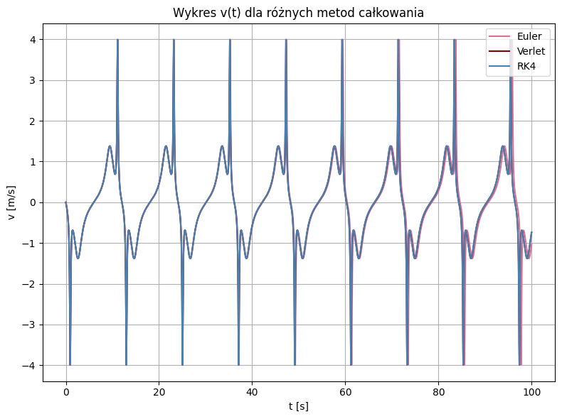

**Observation:**  
- Same behavior as in x(t) — Euler diverges after ~25s.  
- RK4 and Verlet are nearly indistinguishable.

---

### 🔹 Phase Portrait – v(x)

  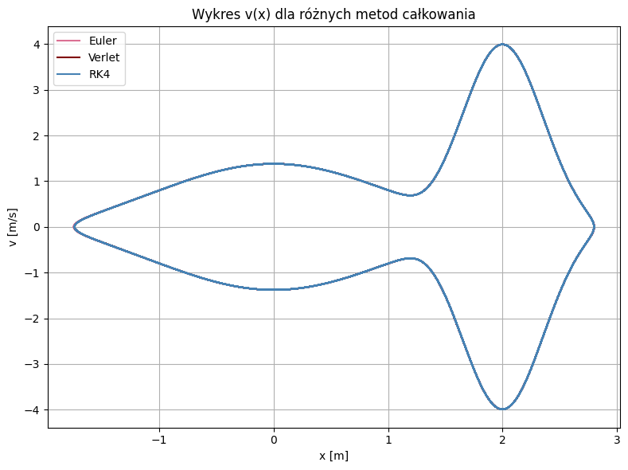

**Observation:**  
- Despite the time shift, all methods produce identical phase portraits.  
- This is expected: v(x) depends on spatial trajectory, not time — even if timing differs, the path in phase space is preserved.

---

### 🔹 Total Energy over Time – E(t)

  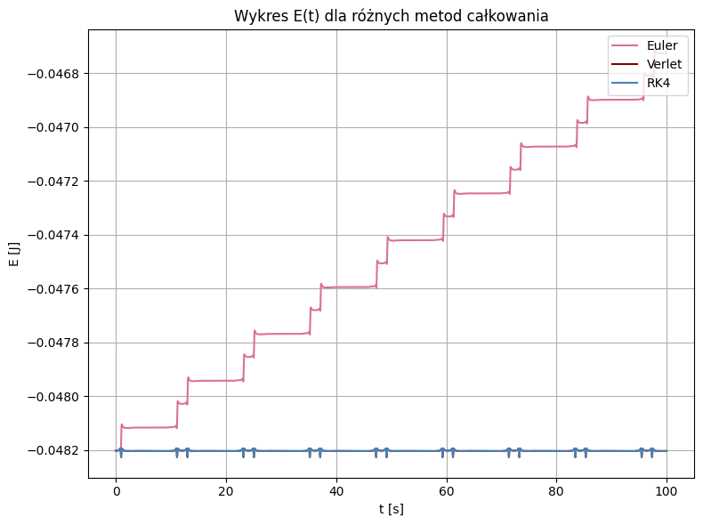

**Observation:**  
- Euler shows unphysical energy increase → indicates poor energy conservation.  
- RK4 and Verlet conserve total energy well, with small oscillations near potential wells due to abrupt force changes.  
- Oscillations in E(t) are physically expected and bounded.

---

### 🔸 Summary Table – Step Sizes and Accuracy

  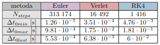

**Interpretation:**  
- RK4 uses the largest time step, yet produces highly accurate results due to its 4th order accuracy.  
- Euler, being 1st order, requires a very small step to avoid unphysical results.  
- Verlet is a good compromise: fewer steps than Euler, much better energy behavior.

---
---

## Convergence Analysis

> To quantify how the error depends on the time step `dt`, we computed the **absolute position error at time t = 1.1 s** for various step sizes.  
> As the reference value `x_ref`, we used the RK4 result with a very small step `dt = 1e-7 s`.

Different time step ranges were tested per method, based on their expected accuracy:

- Euler: dt ∈ [1e-1, 1e-7]  
- Verlet: dt ∈ [1e-1, 5e-6]  
- RK4: dt ∈ [1e-1, 5e-4]

Each test was performed with logarithmic spacing (half-decade steps).

---

### 🔹 Log-Log Plot of Error vs. Time Step

  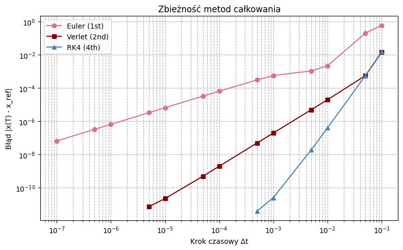

 **Observation:**

- All methods exhibit **linear behavior in log-log scale**, confirming power-law dependence.
- Euler shows slightly more scatter (expected for 1st order).
- Fitted slopes indicate convergence orders consistent with theory:
  - Euler: slope ≈ 1.07 ± 0.06
  - Verlet: slope ≈ 2.07 ± 0.06
  - RK4: slope ≈ 4.22 ± 0.12

These values match the expected orders:  
Euler → 1st order, Verlet → 2nd order, RK4 → 4th order.

---

## Adaptive Time Step Integration

> In this experiment, we applied each method with a **variable time step**, adjusted dynamically to maintain a given position error tolerance.  
> The tolerance was fixed at: `tol = 1e-7`.  
> Each method started with a different `dt₀` based on stability and responsiveness:

- Euler: dt₀ = 1e-4 s  
- Verlet: dt₀ = 1e-3 s  
- RK4: dt₀ = 1e-2 s  

As before, dx = 1e-3 m.

---

### Adaptive Time Step Statistics

  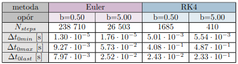

 **Interpretation:**

- **Euler** required far more steps due to its low accuracy (N = 313k) and was forced to use very small `dt`.
- **RK4** used the fewest steps and achieved the largest maximum `dt` thanks to its high-order precision.
- **Verlet** performed well — a good trade-off between number of steps and accuracy.

---

### 🔹 Position over Time – x(t)

  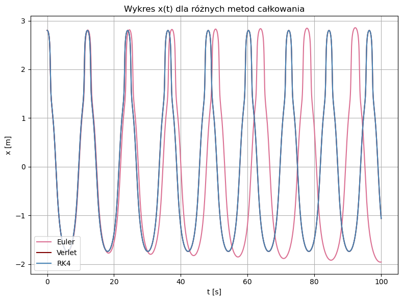

**Observation:**  
- All methods agree up to about **t ≈ 15 s**, after which **Euler diverges**.  
- This is due to adaptive time steps not being small enough to fully correct Euler’s accumulated error.  
- RK4 and Verlet match perfectly throughout.

---

### 🔹 Velocity over Time – v(t)

  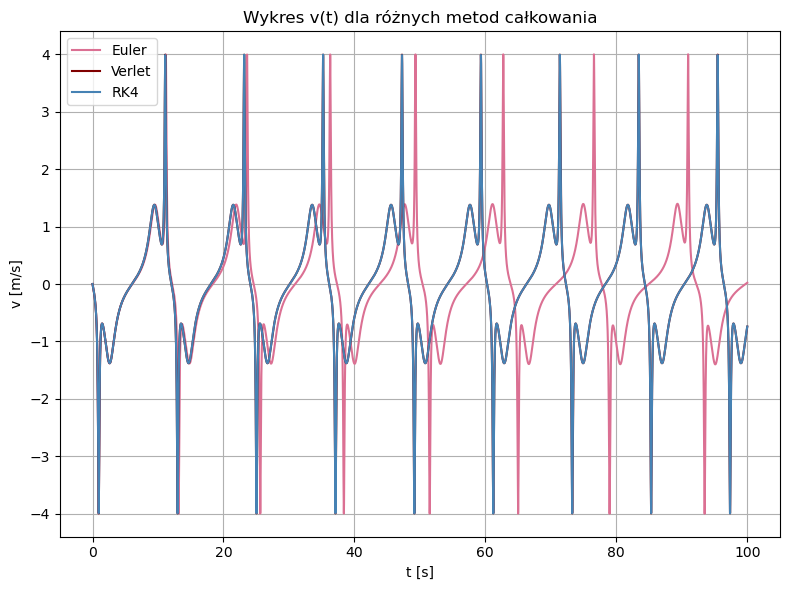

**Observation:**  
- Behavior matches x(t): Euler shows visible divergence over time.  
- RK4 and Verlet remain synchronized.

---

### 🔹 Phase Portrait – v(x)

  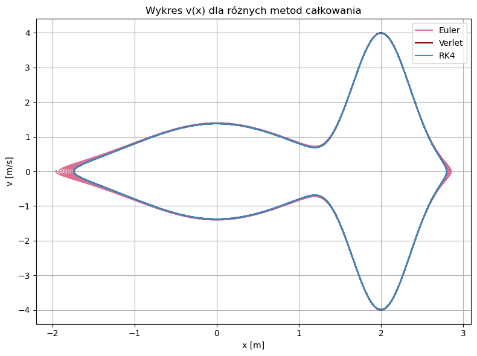

**Observation:**  
- Euler's phase portrait begins to deform, especially in regions of high acceleration.  
- RK4 and Verlet maintain smooth and closed trajectories.

---

### 🔹 Total Energy over Time – E(t)

  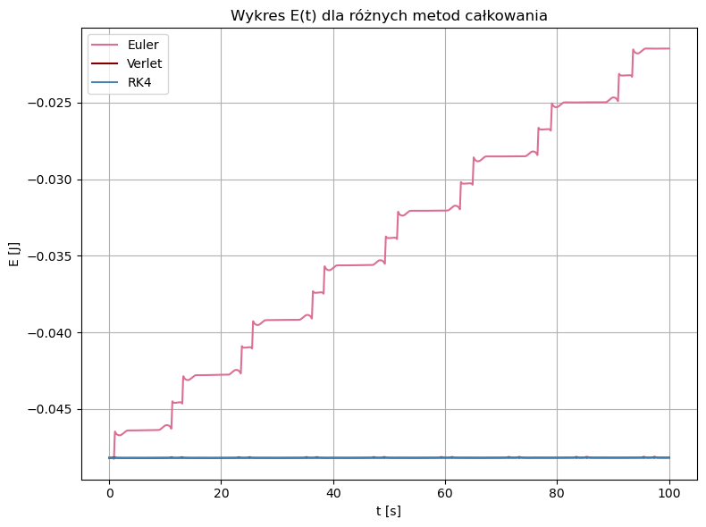

**Observation:**  
- Euler shows significant **energy drift** — an artifact of its explicit formulation and lack of internal averaging.  
- RK4 and Verlet show small **energy drift** (not visible compared to Euler), with expected oscillations near turning points.

---

## Motion with Damping – Resistance Force

> To simulate dissipative systems, we introduced a **linear resistance force** of the form `F = -b * v`, with damping coefficients:  
> - `b = 0.5` → moderate damping  
> - `b = 5.0` → strong damping  

Only two methods were tested here: **Euler** and **RK4**, both with adaptive time step (tolerance: `1e-7`).

---

###  Time Step Stats with Damping

  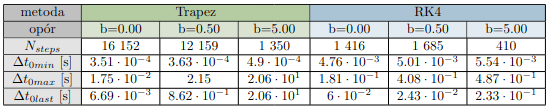

 **Interpretation:**

- As in earlier tests, **Euler** needed many more steps with smaller `dt`.  
- With stronger damping, the motion becomes simpler and slower, allowing **larger time steps**.  
- Both methods adapt well to increased damping — simulation is faster and more stable.

---

### 🔹 Position over Time – x(t)

  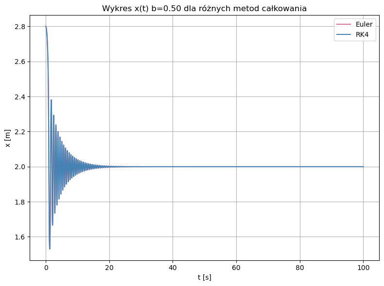  
  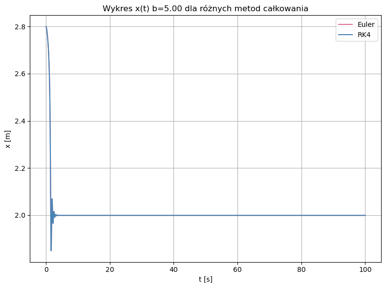

**Observation:**  
- For both b = 0.5 and b = 5.0, the system settles to rest due to energy loss.  
- Euler and RK4 are in close agreement — error accumulation is limited because the system quickly damps out.

---

### 🔹 Velocity over Time – v(t)

  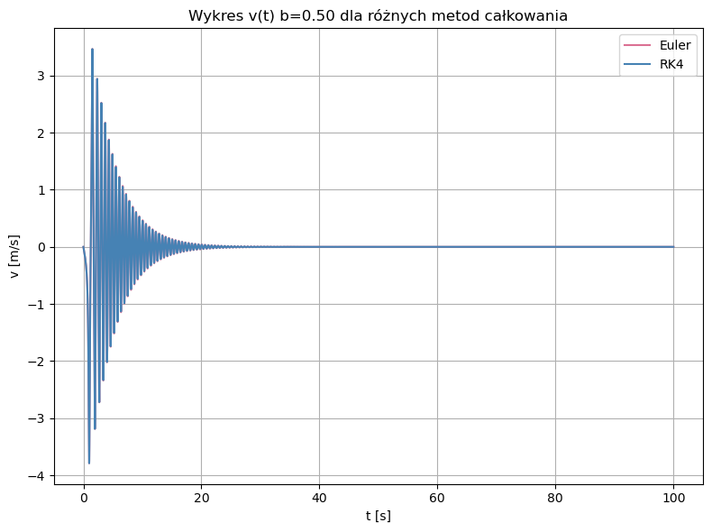  
  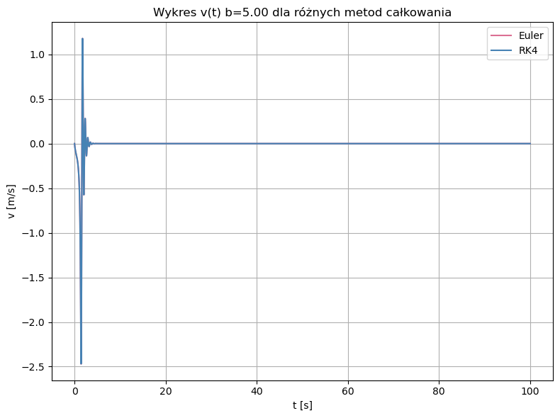

**Observation:**  
- Oscillations die out quickly due to damping.  
- Slight differences appear for b = 0.5, especially at turning points, but are minor.  
- For b = 5.0, both methods converge almost identically.

---

### 🔹 Phase Portrait – v(x)

  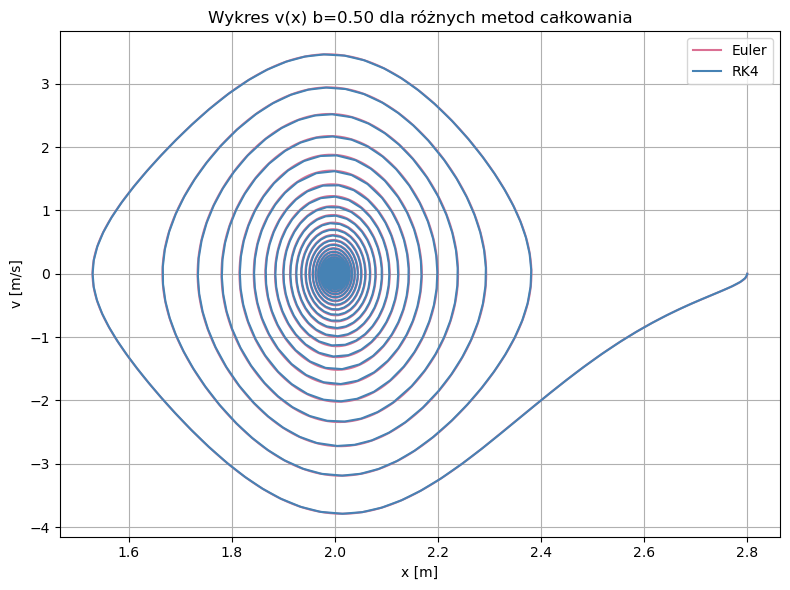  
  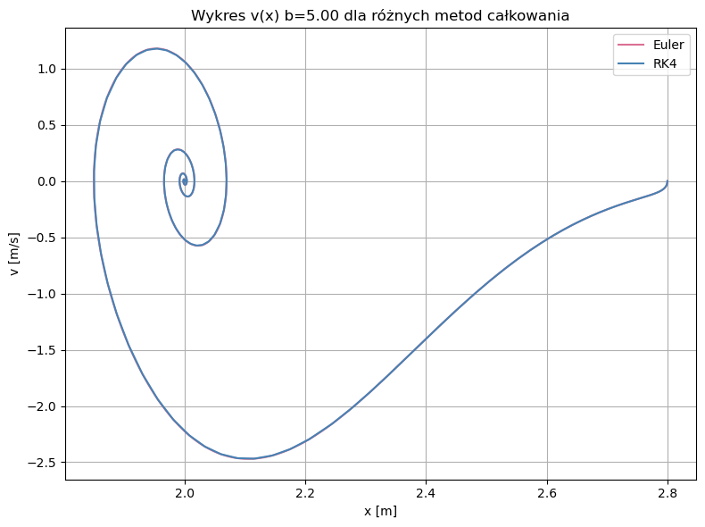

**Observation:**  
- Trajectories spiral into rest — typical of damped harmonic motion.  
- Euler slightly deviates in the inner loop (b = 0.5), but remains accurate overall.

---

### 🔹 Total Energy over Time – E(t)

  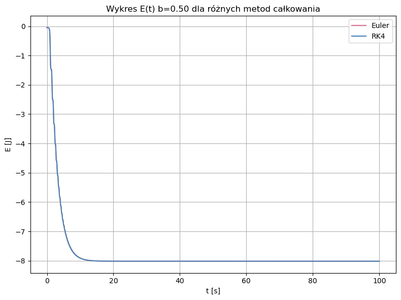  
  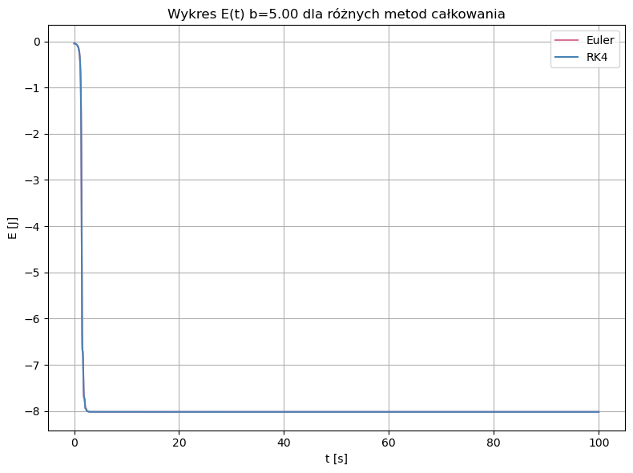

**Observation:**  
- Both methods correctly capture energy loss due to damping.  
- No artificial energy increase is observed, even for Euler.

---

## Trapezoidal Method vs. RK4

> In the final stage, we applied the **Trapezoidal Method** with adaptive time step and compared it against RK4.  
> Simulations were run with three damping levels:
> - b = 0.0 (no resistance)
> - b = 0.5 (moderate damping)
> - b = 5.0 (strong damping)

Initial step: `dt₀ = 0.1 s`  
Tolerance: `tol = 1e-7`

---

### Step Count and Time Step Statistics

  

 **Key Takeaways:**

- **Trapezoidal Method** takes more steps than RK4 due to its lower order (2nd vs. 4th).  
- Its minimum `dt` is smaller, and it adapts more sensitively to fast-changing dynamics.  
- Interestingly, the **maximum and final step sizes** for `b = 5.0` are higher than RK4 — method performs well under high damping.

---

### 🔹 Position over Time – x(t)

  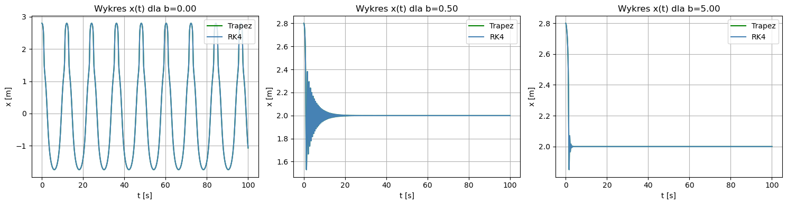

**Observation:**  
- Trapezoid and RK4 produce nearly identical results.  
- Minor deviations appear at b = 0.5 (low damping), especially at the beginning of motion.  
- For b = 0.0 and b = 5.0, curves match very closely.

---

### 🔹 Velocity over Time – v(t)

  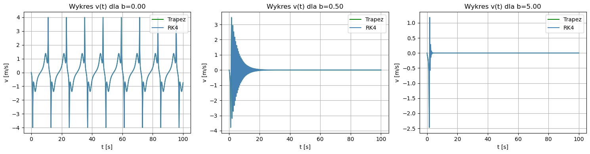

**Observation:**  
- Velocity trends are consistent across methods and damping levels.  
- Only for low damping (b = 0.5), some small differences are visible.

---

### 🔹 Phase Portrait – v(x)

  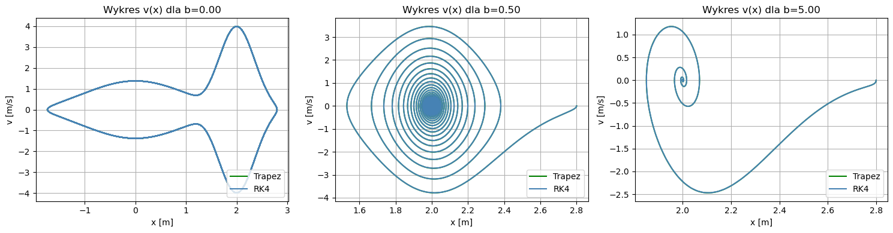

**Observation:**  
- Excellent match between methods.  
- All phase spirals converge to rest as expected due to damping.  
- Deviations are negligible.

---

### 🔹 Total Energy over Time – E(t)

  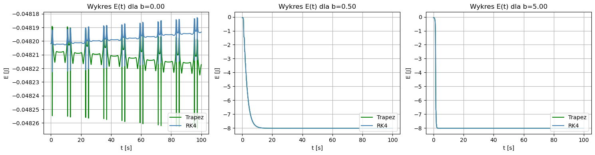

**Observation:**  
- For **b = 0.5 and b = 5.0**, both methods conserve energy trends identically.  
- However, for **b = 0.0 (no damping)**:
  - RK4 shows **energy increase** (as previously noted)  
  - Trapezoidal Method shows **energy decay**, indicating numerical dissipation.

This confirms the **energy-dissipative nature** of the trapezoidal scheme — it tends to artificially lose energy in undamped systems.

---

## ✅ Final Remarks

- **Best Accuracy:** RK4  
- **Best for Dissipative Dynamics:** Trapezoidal  

All simulations used consistent initial conditions and tolerances. Code and visualizations are included in this repository.

---

> For full implementation details, plots, and method comparisons – see the `/img` folder and source scripts.

